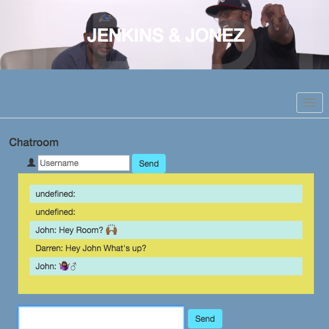

# Socket.io Chat App

### I wanted to create something dynamic and interactive so what better than instant messaging? This is a very basic chat app that covers the basis and leaves lots of room for improved features. 
---
## Technologies used
- Node.JS
- Express.JS
- EJS
- Animate.CSS
- Boostrap
---
### Take a look at the app [HERE](https://jenkinsandjonez.herokuapp.com/) on Heroku. 
---
### Screenshot: 
]
#### By Darren N. 2018
